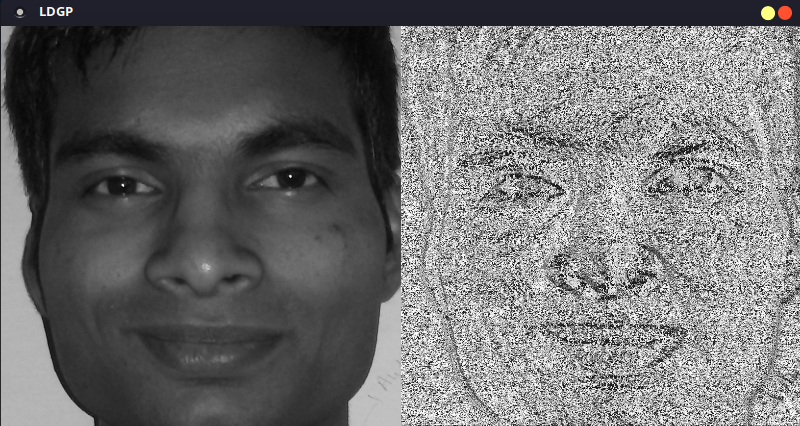

### Server and client are two separate modules ###

*1. First of all create dependencies. Go to server directory and run `make dependency` will install all the dependencies*

*2. Now create database. Run `make database` will ask root directory of database usi g GUI. Provide it the directory and database will be created*

*3. To run the server, go into server directory `make server` now enter the port you want to run your server on server will print the ip address of machine, note down this ip address and then run client*

*4. Goto client folder and `make run` will ask ip address and port of server. enter both and client will connect to server*

**Server.py**
	takes two arguments, ip address of local machine and port camera number is hardcoded as /dev/video0. If you want to change the camera then modify server.py
**ldgp.py**
	calcgrad function returns ldgp image hist function returns histogram of an image with 64 bins dist function returns euclidean distance between to one dimensional arrays

**client.py**
	takes input from camera and runs algorithm locally

**realtime.py**
	outputs runtime ldgp image 

**static.py**
	implementation to compare images statically

**database.py**
	takes root folder of database as argument and saves database in data directory. Make sure that images are in tree format. Looks like this
- root---->
	- person1---->
		- person1_1.photo
		- person1_2.photo
		- 
		- 
		- 
		- person1_n.photo
	- person2---->
		- 
		- 
		- 
		- 
		- |
	- personn---->
		- personn_1.photo
        - personn_2.photo
        - personn_n.photo
#### Following image shows image and corresponding ldgp feature vector

